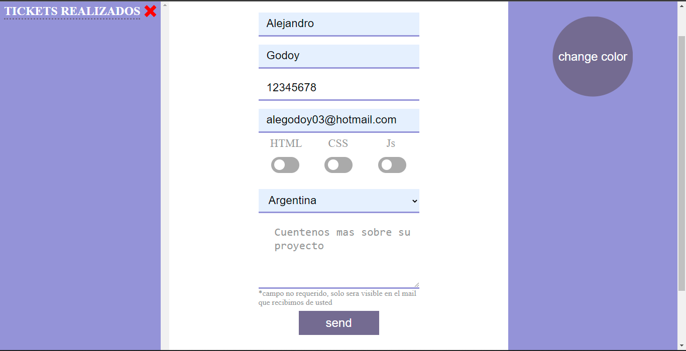
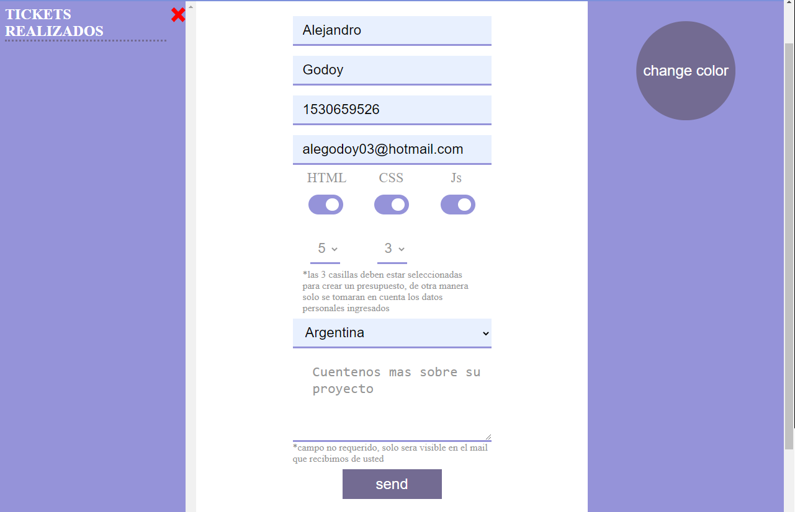
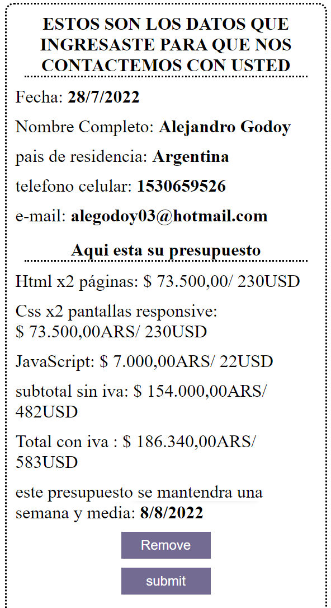
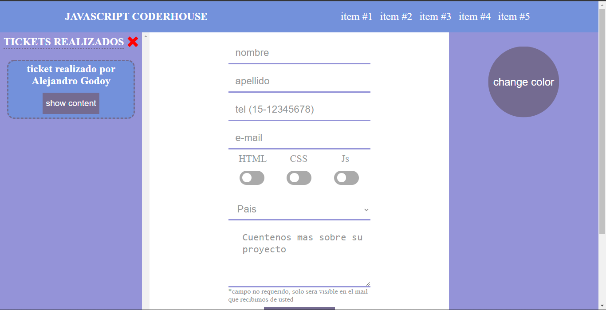
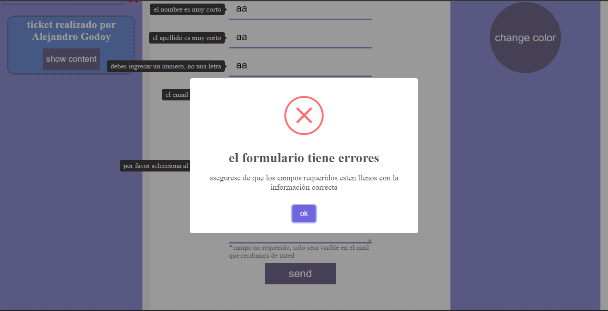
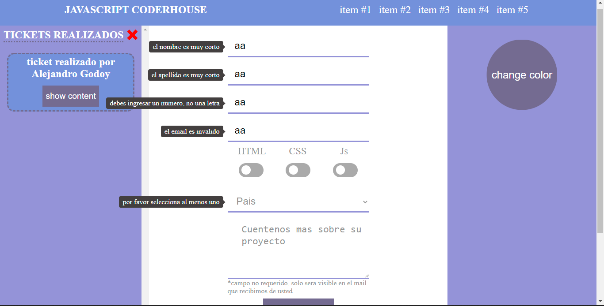

# Formulario de contacto con generador de presupuesto

 Este proyecto fue pensado desde el comienzo para poder incorporarse de manera organica a un formulario que se encuentra en mi proyecto de Portafolio que lo puede encontrar en mi perfil o verlo desde [aqui](https://chipper-chimera-cd34bc.netlify.app/ "Portafolio Alejandro Godoy")

 La idea es que funcione como un formulario que sea facil y concizo a lo que el usuario busca, asi como también generar un presupuesto estimativo de lo que costaria armar una pagina web usando 3 herramientas principales como base de desarrollo: Html, Css y Javascript.

## Funcionamiento

La página cuenta con fuciones sincronicas y asincronicas para optimizar su funcionamiento. Visualmente este seria el resultado

* Al ingresar los datos sin la opcion de crear un presupuesto, el formulario quedaria asi: 
    * Lo que daria como resultado un ticket con datos simples para enviar via mail 
* En cambio, si decide darle check a las casillas, podrá acceder a los select que estan conformados por la cantidas de Html que desea, la cantidad de pantallas que desee que su proyecto abarque con Css responsive y si desea darle funcionabilidad a la pagina con javascript, lo que quedaria asi: 
    * lo que daria como resultado el siguiente ticket 
* En estos dos casos, tiene las opciones de eliminar el ticket generado o enviarlos via email, lo que tambien conlleva a que sean almacenados en el LocalStorage y mostrados en pantalla de la siguiente forma 

La página tambien cuenta con una libreria que valida los datos ingresados para que no sea posible ingresar un dato erroneo y enviar formularios no deseados

## Librerias utilizadas

Finalmente, este proyecto se logro gracias a varias librerias y apis que facilitaron la validacion del formulario, alertas esteticas, entre otras cosas. Las estare nombrando a continuación:

* [justValidate](https://just-validate.dev/ "Just-Validate.com") para la validación principal del formulario
* [SweetAlert2](https://sweetalert2.github.io/ "SweetAlert2.com") para todas las alertas que acompañan al usuario en la página
* [Luxon](https://moment.github.io/luxon/#/ "luxonJs.com") para generar fechas de manera dinamica y de facil inserción
* [DolarSi](https://www.dolarsi.com/ "dolarsi.com") para la api que proporciona los datos necesarios para generar un ticket que actualiza solo sus precios
 

